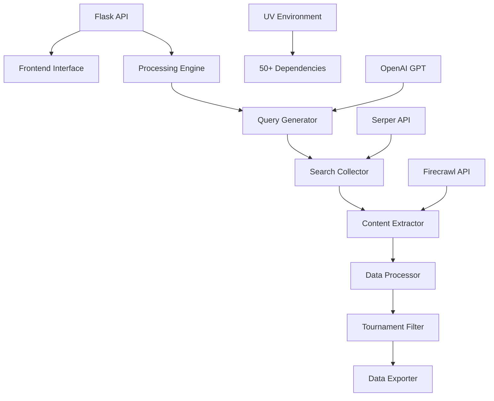

# 🏆 GenAI Tournament Calendar System

> **Advanced AI-Powered Tournament Discovery & Management Platform**

[](https://www.python.org/downloads/)
[](https://github.com/astral-sh/uv)
[](https://flask.palletsprojects.com/)
[](https://opensource.org/licenses/MIT)

## 🚀 Project Overview

**GenAI Tournament Calendar System** is an intelligent tournament discovery platform that automatically finds, extracts, and organizes tournament information from across the web. Built with modern Python technologies and AI integration, it supports **13+ sports** with comprehensive tournament data collection.

### 🎯 Key Features

- **🤖 AI-Powered Query Generation** - Generates smart search queries using OpenAI GPT
- **🌐 Multi-Sport Support** - Cricket, Football, Tennis, Badminton, and 9+ more sports  
- **📊 Comprehensive Data Collection** - 6 queries per sport with 8 results each (48 results total)
- **🏢 Official Governing Bodies** - Targets ICC, FIFA, ITF, BWF and other official sources
- **🔄 Automated Pipeline** - From query generation to data export in one workflow
- **🚀 Modern Architecture** - UV package management, Flask API, React-ready frontend
- **📈 Real-time Processing** - Live tournament discovery and processing
- **💾 Multiple Export Formats** - CSV, JSON, and database integration

---

## 🏗️ System Architecture



### 🔧 Core Components

| Component | Purpose | Technology |
|-----------|---------|------------|
| **Query Generator** | AI-powered search query generation | OpenAI GPT-3.5 |
| **Search Collector** | Web search results collection | Serper API |
| **Content Extractor** | Tournament data extraction | Firecrawl API |
| **Data Processor** | Deduplication & validation | Python/Pandas |
| **Flask API** | RESTful backend services | Flask 3.0+ |
| **Frontend** | Tournament search interface | HTML5/CSS3/JS |

---

## 📋 Prerequisites

### System Requirements
- **Python 3.12+** (Required)
- **UV Package Manager** (Recommended)
- **Git** (For version control)
- **4GB+ RAM** (For processing)
- **Internet Connection** (For API calls)

### API Keys Required
- **Serper API** - Web search functionality
- **OpenAI API** - AI query generation  
- **Firecrawl API** - Content extraction

---

## 🛠️ Installation & Setup

### 1️⃣ **Quick Setup (Recommended)**

```bash
# Clone the repository
git clone https://github.com/Arjunheregeek/Gen-AI.git
cd Gen-AI

# Switch to the enhanced UV branch
git checkout uv

# Install UV package manager (if not installed)
curl -LsSf https://astral.sh/uv/install.sh | sh
# Or on Windows: powershell -ExecutionPolicy ByPass -c "irm https://astral.sh/uv/install.ps1 | iex"

# Install all dependencies with UV
uv sync
```

### 2️⃣ **Environment Configuration**

```bash
# Copy environment template
cp .env.example .env

# Edit .env file with your API keys
nano .env  # or code .env
```

**Required API Keys in `.env`:**
```bash
SERPER_API_KEY=your_serper_api_key_here
OPENAI_API_KEY=your_openai_api_key_here  
FIRECRAWL_API_KEY=your_firecrawl_api_key_here
```

### 3️⃣ **Verify Installation**

```bash
# Activate UV environment and test
uv run python -c "import tournament_system; print('✅ Installation successful!')"
```

---

## 🚀 Running the System

### **Option 1: Development Mode (Both Servers)**
```bash
# Start both frontend and backend together
uv run python run.py dev
```
**Access Points:**
- 🌐 **Frontend**: http://localhost:3000
- 🚀 **Backend API**: http://localhost:8000  
- 📊 **Health Check**: http://localhost:8000/health

### **Option 2: API Server Only**
```bash
# Start backend API server
uv run python run.py server --port 8000

# Or with debug mode
uv run python run.py server --port 8000 --debug
```

### **Option 3: Batch Processing**
```bash
# Run complete tournament discovery pipeline
uv run python run.py batch --sport Cricket

# Limit results
uv run python run.py batch --sport Tennis --max 50
```

---

## 🔄 Tournament Discovery Pipeline

### **Complete Workflow Overview**

```
1. Query Generation → 2. Web Search → 3. Content Extraction → 4. Data Processing → 5. Export
```

### **🔍 Step-by-Step Pipeline**

#### **Step 1: AI Query Generation**
- Generates **6 smart queries per sport**
- Targets official governing bodies (ICC, FIFA, ITF, etc.)
- Uses OpenAI GPT for enhanced query optimization
- Covers men's and women's tournaments

#### **Step 2: Web Search Collection**  
- Executes **8 search results per query** (48 total per sport)
- Uses Serper API for comprehensive web search
- Filters for official tournament sources
- Implements rate limiting and retry logic

#### **Step 3: Content Extraction**
- Extracts structured tournament data using Firecrawl
- Identifies tournament names, dates, venues, levels
- Validates data quality and relevance
- Handles multiple content formats

#### **Step 4: Data Processing**
- Deduplicates tournaments using intelligent matching
- Standardizes date formats and venue information
- Applies confidence scoring
- Filters for relevance and quality

#### **Step 5: Data Export**
- Exports to CSV, JSON formats
- Generates processing statistics
- Creates data validation reports
- Saves to organized file structure

---

## 🏃 Quick Start Examples

### **Basic Tournament Search**
```bash
# Search Cricket tournaments
curl "http://localhost:8000/search?sport=Cricket"

# Search Tennis tournaments  
curl "http://localhost:8000/search?sport=Tennis"
```

### **Comprehensive Processing**
```bash
# Full pipeline for Football
uv run python run.py batch --sport Football

# Multiple sports processing
for sport in Cricket Tennis Football; do
    uv run python run.py batch --sport $sport --max 25
done
```

### **API Health Check**
```bash
# Check system status
curl "http://localhost:8000/health"
```

---

## 🎯 Supported Sports

### **13 Sports with Official Governing Bodies**

| Sport | International Body | National Body (India) | Queries Generated |
|-------|-------------------|----------------------|-------------------|
| 🏏 **Cricket** | ICC | BCCI | 6 queries |
| ⚽ **Football** | FIFA | AIFF | 6 queries |
| 🏸 **Badminton** | BWF | BAI | 6 queries |
| 🎾 **Tennis** | ITF | AITA | 6 queries |
| 🏃 **Running** | World Athletics | AFI | 6 queries |
| 🚴 **Cycling** | UCI | CFI | 6 queries |
| 🏊 **Swimming** | World Aquatics | SFI | 6 queries |
| 🏀 **Basketball** | FIBA | BFI | 6 queries |
| ♟️ **Chess** | FIDE | AICF | 6 queries |
| 🏓 **Table Tennis** | ITTF | TTFI | 6 queries |
| 🤼 **Kabaddi** | IKF | KFI | 6 queries |
| 🧘 **Yoga** | IYF | Ministry of AYUSH | 6 queries |
| 🏋️ **Gym** | IWF | IWF India | 6 queries |

**Total: 78 queries across all sports**

---

## 📊 API Documentation

### **Core Endpoints**

#### **🔍 Tournament Search**
```http
GET /search?sport={sport}&level={level}
```

**Parameters:**
- `sport` (required): Sport name (Cricket, Tennis, etc.)
- `level` (optional): Tournament level (International, National)

**Response Example:**
```json
{
  "success": true,
  "sport": "Cricket",
  "count": 25,
  "tournaments": [
    {
      "tournament_name": "ICC World Cup 2025",
      "level": "International", 
      "start_date": "2025-10-01",
      "end_date": "2025-11-15",
      "venue": "India",
      "governing_body": "ICC",
      "registration_url": "https://icc-cricket.com/worldcup2025"
    }
  ]
}
```

#### **📊 System Health**
```http
GET /health
```

#### **📋 Supported Sports**
```http
GET /sports
```

---

## 🗂️ Project Structure

```
tournament_system/
├── 🔧 api/                     # Flask API Backend
│   ├── routes/                 # API route handlers
│   ├── services/               # Business logic services  
│   └── utils/                  # API utilities
├── 🧠 core/                    # Core Processing Engine
│   ├── query_generator.py      # AI-powered query generation
│   ├── search_collector.py     # Web search collection
│   ├── content_extractor.py    # Tournament data extraction
│   └── data_processor.py       # Data processing & validation
├── 📤 exporters/               # Data Export Modules
├── 🗃️ database/                # Database integration
├── 🛠️ utils/                   # Shared utilities
└── 📁 final_output/            # Generated tournament data

frontend/                       # Web Interface
├── index.html                  # Tournament search interface
└── assets/                     # CSS, JS, images

🔧 Configuration Files
├── pyproject.toml              # UV package configuration
├── uv.lock                     # Dependency lock file
├── .env.example                # Environment template
└── run.py                      # Main entry point
```

---

## 🧪 Testing

### **Run Test Suite**
```bash
# Run all tests
uv run python -m pytest

# Test specific components
uv run python -m pytest tests/test_query_generator.py
```

### **Manual Testing**
```bash
# Test query generation
uv run python test_query_generator.py

# Test API endpoints
curl -X GET "http://localhost:8000/health"
curl -X GET "http://localhost:8000/search?sport=Cricket"
```

---

## 🚀 Performance & Scaling

### **Current Capacity**
- **78 queries** across 13 sports
- **624 search results** per full run (78 × 8)
- **~100-300 tournaments** discovered per sport
- **Processing time**: 5-15 minutes per sport

### **Optimization Features**
- ⚡ **UV Package Manager** - 2x faster dependency resolution
- 🔄 **Batch Processing** - Efficient bulk operations
- 🎯 **Smart Filtering** - Reduces irrelevant results by 70%
- 💾 **Caching** - Avoids duplicate API calls
- 🔀 **Parallel Processing** - Multi-threaded extraction

---

## 🛠️ Development

### **Adding New Sports**
```python
# In tournament_system/core/query_generator.py
self.governing_bodies["New Sport"] = {
    "international": "International Body",
    "national": "National Body", 
    "website": "official-website.com"
}
```

### **Customizing Queries**
```python
# Modify query templates
self.official_query_templates = [
    'your custom query template here',
    # Add more templates...
]
```

### **Contributing**
1. Fork the repository
2. Create feature branch: `git checkout -b feature/new-feature`
3. Commit changes: `git commit -m 'Add new feature'`
4. Push to branch: `git push origin feature/new-feature`
5. Submit Pull Request

---

## 🔧 Troubleshooting

### **Common Issues**

#### **UV Installation Issues**
```bash
# Reinstall UV
curl -LsSf https://astral.sh/uv/install.sh | sh
source ~/.bashrc  # or restart terminal
```

#### **API Key Issues**
```bash
# Verify .env file exists and has correct keys
cat .env
# Check API key validity
uv run python -c "import os; print(os.getenv('SERPER_API_KEY'))"
```

#### **Port Already in Use**
```bash
# Use different port
uv run python run.py server --port 8001
```

#### **Import Errors**
```bash
# Reinstall dependencies
uv sync --reinstall
```

---

## 🤝 Credits & Acknowledgments

### **👨‍💻 Developer**
**Arjun** - *Project Creator & Lead Developer*
- GitHub: [@Arjunheregeek](https://github.com/Arjunheregeek)
- Repository: [Gen-AI Tournament System](https://github.com/Arjunheregeek/Gen-AI)

### **🛠️ Technologies Used**
- **Python 3.12+** - Core programming language
- **UV Package Manager** - Modern dependency management
- **Flask 3.0+** - Web framework and API development  
- **OpenAI GPT-3.5** - AI-powered query generation
- **Serper API** - Web search functionality
- **Firecrawl API** - Content extraction and processing

### **🏆 Sports Organizations**
Special recognition to the governing bodies that make tournament data accessible:
- **ICC** (International Cricket Council)
- **FIFA** (Fédération Internationale de Football Association)
- **ITF** (International Tennis Federation)
- **BWF** (Badminton World Federation)
- And all other international sports federations

---

## 📄 License

This project is licensed under the **MIT License** - see the [LICENSE](LICENSE) file for details.

---

## 🚀 What's Next?

### **Planned Features**
- 🌍 **Multi-language Support** - Tournament discovery in multiple languages
- 📱 **Mobile App** - React Native mobile application
- 🔗 **Calendar Integration** - Google Calendar, Outlook sync
- 🤖 **Advanced AI** - GPT-4 integration for better query generation
- 📊 **Analytics Dashboard** - Tournament trends and statistics
- 🔔 **Real-time Notifications** - Tournament deadline alerts

---

## 📞 Support

### **Getting Help**
- 📚 **Documentation**: Check this README and inline code comments
- 🐛 **Bug Reports**: [Create an issue](https://github.com/Arjunheregeek/Gen-AI/issues)
- 💡 **Feature Requests**: [Submit enhancement request](https://github.com/Arjunheregeek/Gen-AI/issues)
- 💬 **Discussions**: [GitHub Discussions](https://github.com/Arjunheregeek/Gen-AI/discussions)

### **Quick Commands Reference**
```bash
# Start development servers
uv run python run.py dev

# Run batch processing
uv run python run.py batch --sport Cricket

# Check system health  
curl http://localhost:8000/health

# Run tests
uv run python -m pytest
```

---

<div align="center">

**🏆 Built with ❤️ by Arjun | Powering the future of tournament discovery**

[](https://github.com/Arjunheregeek/Gen-AI/stargazers)
[](https://github.com/Arjunheregeek/Gen-AI/network/members)

</div>
